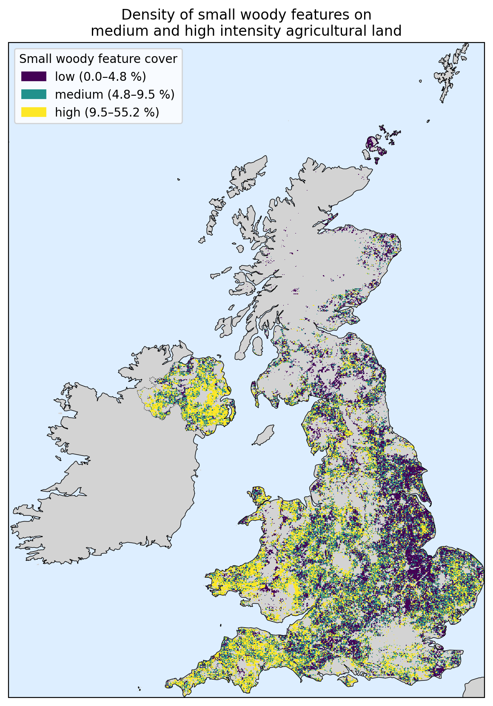

# Small woody features on intensive agricultural land in the United Kingdom

Jupyter notebook that estimates the share of each 1 km pixel of medium- and high-intensity
agricultural land covered by small woody features (hedgerows, tree lines, small patches of trees),
as an indicator of agrobiodiversity.



## Method

1. Clip the 1 km LAMASUS land use management map to the study area and select the
   agricultural classes listed in `AGRI_CLASSES` (currently 520, 530, 620, 630).
2. Count the 5 m Copernicus Small Woody Features pixels inside each selected 1 km pixel.
3. Convert counts to percentage cover and map them in three classes (tertiles).

All processing happens in EPSG:3035 (ETRS89-LAEA), the native projection of both rasters.

## Running it

```bash
conda env create -f environment.yml
conda activate agrobiodiversity
jupyter lab Agrobiodiversity_UK.ipynb
```

Download the input data (see below) into the notebook folder, or change `DATA_DIR` in the
configuration cell. The data files are not included in this repository.
Outputs are written to `output/` (GeoTIFFs) and `figures/` (map).

## Data sources

Please cite the original datasets if you reuse this work.

| Dataset | File | Citation |
|---|---|---|
| Copernicus HRL Small Woody Features 2018 (raster, 5 m) | `HRL_Small_Woody_Features_2018_005m.tif` | European Union, Copernicus Land Monitoring Service 2018, European Environment Agency (EEA). https://doi.org/10.2909/a8e683b1-2f96-45c8-827f-580a79413018 |
**Land use management map:** Sandström, Evelina; Namasivayam, Anandi; Oostdijk, Saskia; Scherpenhuijzen, Niek; Debonne, Niels; Verburg, Peter, 2023, *Land system map for Europe*, https://doi.org/10.34894/THARMK
| Country boundary (United Kingdom) | `gb.shp` | simplemaps, https://simplemaps.com
| Coastlines and borders (map background) | via Cartopy | Natural Earth, https://www.naturalearthdata.com (public domain) |

Copernicus data are provided free of charge under the
[Copernicus data policy](https://land.copernicus.eu/en/data-policy); reuse requires the attribution above.


